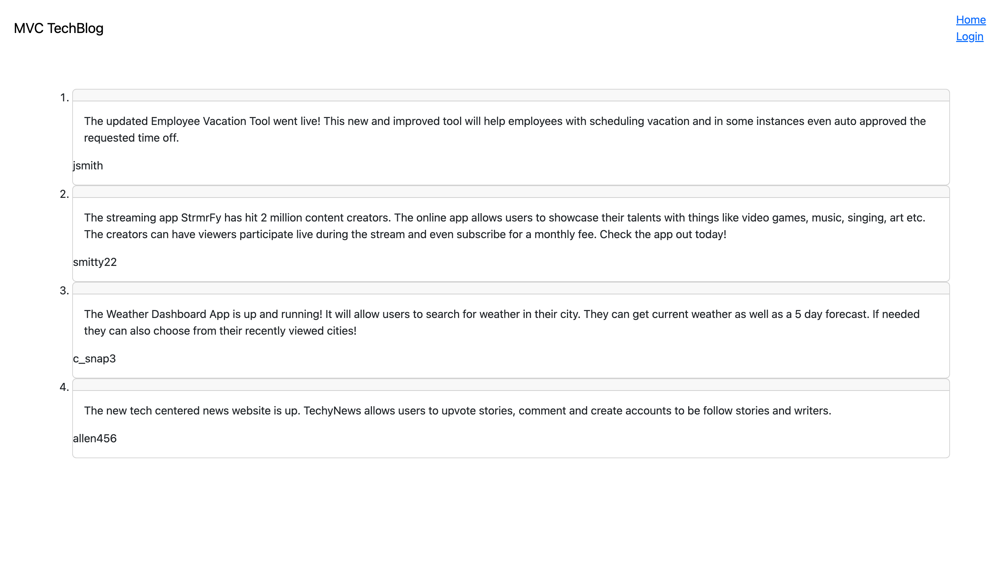
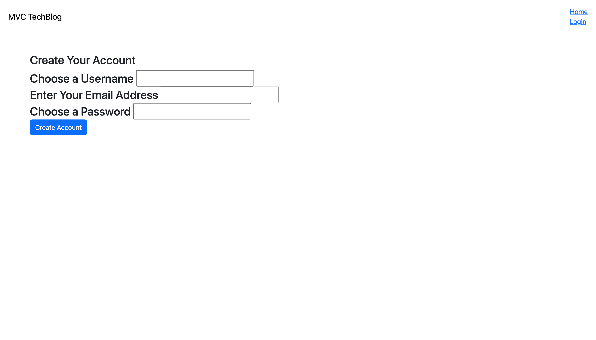

# MVC Techblog Module Challenge

## Description

The purpose of this project was to build an MVC style blog.  It will allow users to view blog posts and comments on those blog posts.  The web application will also allow users to add, delete, and update blog posts.  Additionally they can create accounts and log into the account.

## Application

The application can be viewed at the following address [here](https://jasonstechblog.herokuapp.com/)

This application was made using the MVC layout, in addition to using the Sequelize ORM as well as Node.js, Express.js and the Handlebars template.

## Screenshot

## Links

The link to the [website](https://jasonstechblog.herokuapp.com/) deployed using Heroku.

[Link to the Github](https://github.com/j-faust/mvc-techblog)

## Contact 

My [Email](mailto:jfaust16@gmail.com)
My [GitHub](https://github.com/j-faust)
